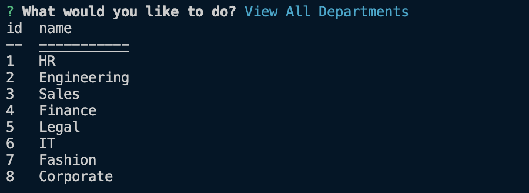
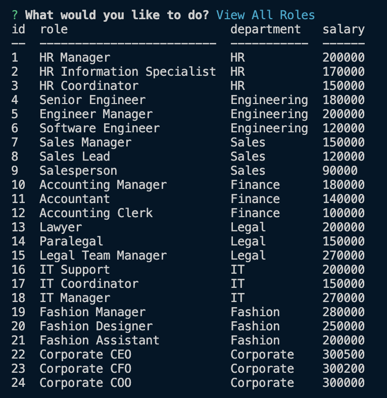
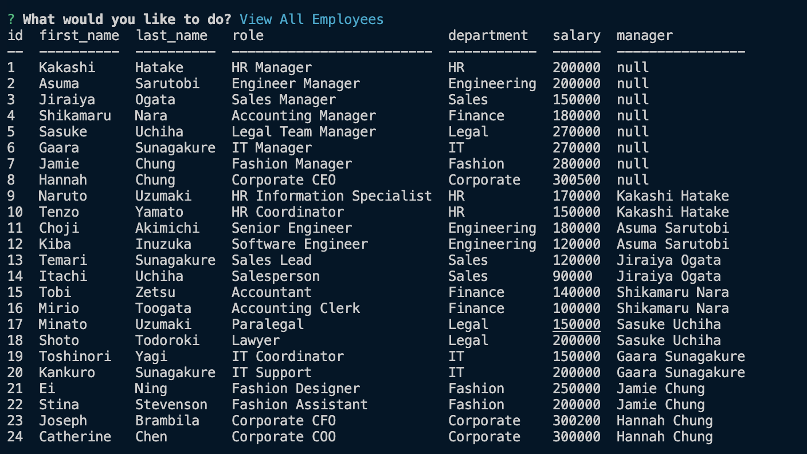
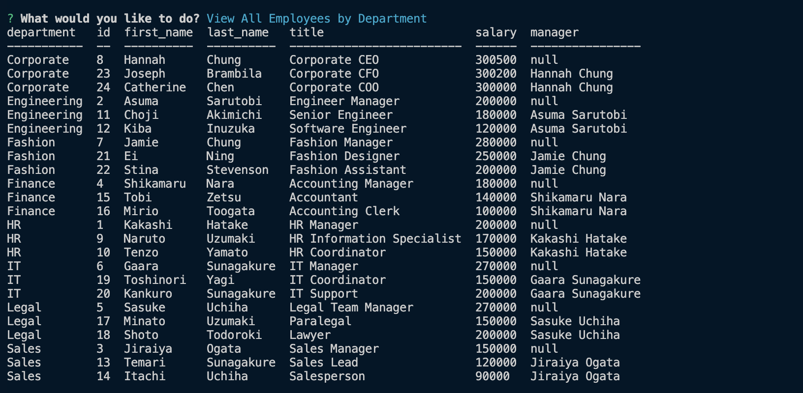
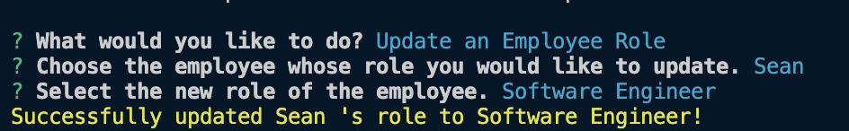

# SQL-Challenge-Employee-Tracker
HW Challenge #12

## Description
For this challenge we had to to build a command-line application from scratch to manage a company's employee database, using Node.js, Inquirer, and MySQL.

This assignment is one of the most challenging assignments we were assigned. I had many challenges such as figuring out how to do the bonus work.Such as update employee managers, View employees by manager, View employees by department, Remove Department, Remove Role, Remove Employee, and View the total utilized budget of a department. Although, with a lot of long nights I finally got it down. Even though this assignment was very challenging and involved a lot of work, I did enjoy learning about SQL.

The success were that I was able to successfully build a command-line application from scratch to manage a company's employee database, using Node.js, Inquirer, and MySQL.


## Table of Contents
* [Installation](#installation)
* [Getting Started and Bonus](#Getting-Started-and-Bonus)
* [User Story](#User-Story)
* [How to Use This Project and Acceptance Criteria](#How-to-Use-This-Project-and-Acceptance-Criteria)
* [Usage](#Usage)
* [Demo](#Demo)
<!-- * [Technologies Used](#Technologies-Used) -->
* [Support](#Support)
* [Credits](#Credits)
* [Contributors](#Contributors)


## Installation
1. Clone the repo
2. Install all dependencies
    - console.table
    - inquirer 8.2.4
    -  mysql2
`````
npm install
`````
3. Create Database Schema
`````
mysql -u root -p
`````
`````
mysql> source ./db/schema.sql
`````
`````
mysql> source db/seeds.sql
`````
4. Run the application 
`````
node server.js
`````

## Getting Started and Bonus

**Getting Started**
You'll need to use the [MySQL2package](https://www.npmjs.com/package/mysql2) to connect to your MySQL database and perform queries, the [Inquirer Package](https://www.npmjs.com/package/mysql2) to interact with the user via the command line, and the [console.package table](https://www.npmjs.com/package/console.table)to print MySQL rows to the console. 

**IMPORTANT**
You will be committing a file that contains your database credentials. Make sure that your MySQL password is not used for any other personal accounts, because it will be visible on GitHub. In upcoming lessons, you will learn how to better secure this password, or you can start researching npm packages now that could help you.


You might also want to make your queries asynchronous. MySQL2 exposes a ```.promise()```function on Connections to upgrade an existing non-Promise connection to use Promises. To learn more and make your queries asynchronous, refer to the [npm documentation on MySQL2](https://www.npmjs.com/package/mysql2)


As the image illustrates, your schema should contain the following three tables:

- ```department```

    * ```id: INT PRIMARY KEY```

    * ```name: VARCHAR(30)``` to hold department name

- ```role```

    * ```id: INT PRIMARY KEY```

    * ```title: VARCHAR(30)``` to hold role title

    * ```salary: DECIMAL``` to hold role salary

    * ```department_id: INT``` to hold reference to department role belongs to

- ```employe```e

    * ```id: INT PRIMARY KEY```

    * ```first_name: VARCHAR(30)``` to hold employee first name

    * ```last_name: VARCHAR(30)``` to hold employee last name

    * ```role_id: INT``` to hold reference to employee role

    * ```manager_id: INT``` to hold reference to another employee that is the manager of the current employee (null if the employee has no manager)


    You might want to use a separate file that contains functions for performing specific SQL queries you'll need to use. A constructor function or class could be helpful for organizing these. You might also want to include a ```seeds.sql file``` to pre-populate your database, making the development of individual features much easier.

**Bonus**

- Try to add some additional functionality to your application, such as the ability to do the following:

    * Update employee managers.
    * View employees by manager.
    * View employees by department.
    * Remove Department 
    * Remove Role 
    * Remove Employee 
    * View the total utilized budget of a department <!-- in other words the combined salaries of all employees in that department. -->


## User Story
- AS A business owner
- I WANT to be able to view and manage the departments, roles, and employees in my company
- SO THAT I can organize and plan my business


## How to Use This Project and Acceptance Criteria

[](https://github.com/hannybear88/SQL-Challenge-Employee-Tracker)
<!-- Click on the button below to be directed straight to the Heroku deployed application -->


- GIVEN a command-line application that accepts user input
- WHEN I start the application
- THEN I am presented with the following options: view all departments, view all roles, view all employees, add a department, add a role, add an employee, and update an employee role
- WHEN I choose to view all departments
- THEN I am presented with a formatted table showing department names and department ids
- WHEN I choose to view all roles
- THEN I am presented with the job title, role id, the department that role belongs to, and the salary for that role
- WHEN I choose to view all employees
- THEN I am presented with a formatted table showing employee data, including employee ids, first names, last names, job titles, departments, salaries, and managers that the employees report to
- WHEN I choose to add a department
- THEN I am prompted to enter the name of the department and that department is added to the database
- WHEN I choose to add a role
- THEN I am prompted to enter the name, salary, and department for the role and that role is added to the database
- WHEN I choose to add an employee
- THEN I am prompted to enter the employee’s first name, last name, role, and manager, and that employee is added to the database
- WHEN I choose to update an employee role
- THEN I am prompted to select an employee to update and their new role and this information is updated in the database
 
 ## Usage

 IF you would like to use this application, open the command-line, make sure you are in the directory you want to be in, once you are in that directory run the command "node server.js", answer the following questions prompted to you, be sure to enter required fields and select from optional additional fields when available, once you have completed the prompt then select "Exit" from the list and you will exited from the application.

 - When the application starts, then the user is presented with the following options listed below: 

    * View All Departments 
    * View All Roles
    * View All Employees 
    * View All Employees by Manager 
    * View All Employees by Department 
    * Add a Department 
    * Add a Role 
    * Add an Employee 
    * Update an Employee Role 
    * Update an Employee Manager 
    * Remove Department 
    * Remove Role 
    * Remove Employee 
    * View the Total Utilized Budget of a Department 
    * Exit
- Then when the user chooses of the options they are presented, the corresponding data will be retrieved and be displayed in a formatted table. 


 ## Demo 

Walkthrough Video

Please [click here](https://youtu.be/t5phnogfH_c) for a walkthrough video that demonstrates the application's functionality.


Screenshots


**View All Departments**


**View All Roles**


**View All Employees**


**View All Employees by Manager**


**View All Employees by Department**


**Add a Department**


* View All Departments After Adding a Department


**Add a Role**


* View All Roles After Adding a Role


**Add an Employee**


* View All Employees After Adding an Employee 
    

**Update an Employee Role**


* View All Employees After Updating Role


**Update an Employee Manager**


* View All Employees After Updating Employee Manager 


**Remove Department**


* View All Departments After Removing a Department


**Remove Role**


* View All Roles After Removing a Role


**Remove Employee**


* View All Employees After Removing an Employee


**View the Total Utilized Budget of a Department**

* HR


* Engineering


* Sales


* Finance


* Legal


* IT


* Fashion


* Corporate


**Exit**


<!-- ## Technologies Used


 -->


## Support 
If you need support or have any questions about the repo, please [open an issue](https://github.com/hannybear88/Node.js-Challenge-Professional-README-Generator/issues) or contact me via email at hannahkchung88@gmail.com. You can find more of my work on my GitHub, [hannybear88](https://github.com/hannybear88/).

## Credits
- Code by Hannah Chung 

## Contributors
- Code by Hannah Chung